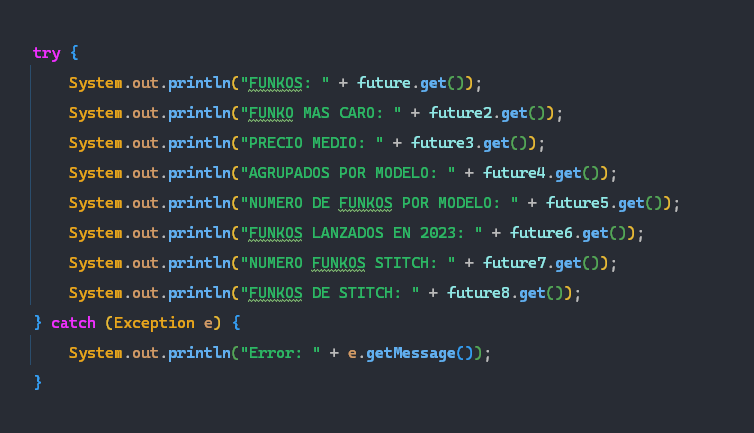

# Funkos Asíncronos

## Autores

- Jaime Medina
- Eva Gómez Uceda

## Arquitectura seguida en el código.

La arquitectura se ha dividido por partes:  
En la carpeta `models` contamos con el apartado de datos, como la clase **Funkos** e **IdGenerator**. La parte de lógica se encuentra en las carpetas `repositories` y `services`, en las que contamos con clases como **FunkoRepositoryImpl**, **FunkoServiceImpl** o **DataBaseManager**. Todas estas se encargan de la parte lógica del programa. Luego también contamos con carpetas como `routes` o `exceptions`, estas contienen las rutas y las excepciones usadas en el programa.  
La carpeta `adapters` con la clase **LocalDateAdapter** implementada por JsonSerializer la usamos para personalizar la serialización de objetos de la clase Funko a formato JSON. En `enums` tenemos definidos los tipos de **Modelo** del que pueden ser los Funkos, y finalmente tendríamos la carpeta `controllers` donde realizamos todas las consultas sobre los datos del CSV.

## Repositories
En esta carpeta nos encontramos con dos paquetes:

### CRUD
En él tenemos la interfaz`CrudRepository`, usada para definir los métodos básicos del Crud y métodos requeridos para este proyecto, siendo estos guardar, actualizar, buscar por ID, buscar por nombre, buscar todos, eliminar por ID y eliminar todos, estas operaciones son realizadas en una colección de objetos de tipo T, utilizando identificadores de tipo ID. Todo ello ha sido realizado de manera asíncrona utilizando `CompletableFuture`.
### Funkos
En este paquete nos encontramos con una interfaz, `FunkoRepository` que extiende la interfaz `CrudRepository`. Y la clase `FunkoRepositotyImpl`que implementa la interfaz `FunkoRepository` , usamos el patrón Singleton y `DataBaseManager` para gestionar la conexión a la base de datos, los métodos son implementados de manera asíncrona usando `CompletableFuture.runAsync`, lo que nos permite realizar las operaciones de manera concurrente mejorando el rendimiento y manejando así mejor las excepciones relacionadas con la base de datos y la serialización de datos en formato JSON.

La clase **FunkoRepositotyImpl** tiene los siguientes métodos codificados:
-   `getInstance(DataBaseManager db)`: Un método estático que permite obtener una única instancia de FunkoRepositoryImpl de manera segura utilizando bloqueo (*ReentrantLock*).
-   `save(Funko funko)`: Almacena un Funko en la base de datos de manera asíncrona y devuelve una instancia de CompletableFuture<Funko>.
-   `update(Funko funko)`: Actualiza un Funko en la base de datos y devuelve una instancia de CompletableFuture<Funko>. Si no se puede actualizar, lanza una excepción.
-   `findById(Long id)`: Busca un Funko por su ID en la base de datos y devuelve una instancia de CompletableFuture<Optional<Funko>>.
-   `findAll()`: Recupera todos los Funkos almacenados en la base de datos y devuelve una instancia de CompletableFuture<List<Funko>>.
-   `deleteById(Long idDelete)`: Elimina un Funko por su ID de manera asíncrona y devuelve una instancia de CompletableFuture<Boolean>. Si no se encuentra el Funko, lanza una excepción.
-   `deleteAll()`: Elimina todos los Funkos en la base de datos de manera asíncrona y devuelve una instancia de CompletableFuture<Void>.
-   `findByNombre(String nombre)`: Busca Funkos por su nombre en la base de datos y devuelve una instancia de CompletableFuture<List<Funko>>.
-   `exportJson(String ruta)`: Exporta la lista de Funkos como JSON en un archivo especificado por la ruta de manera asíncrona y devuelve una instancia de CompletableFuture<Void>.

La mayoría de los métodos funcionan de forma similar, pero así funciona el método findAll:
Primero comenzamos una operación asíncrona con CompletableFuture.supplyAsync(), esto nos permite ejecutar la operación en segundo plano sin bloquear el hilo principal. Después creamos una lista para guardar los Funkos que nos devuelva la base de datos, después nos conectamos a la base de datos con el método **getConnection** de `DataBaseManager` y preparamos la consulta con **prepareStatement**. Introducimos en una variable lo que nos devuelva la consulta, que la ejecutaremos con **executeQuery** . A medida que recorremos esta última variable vamos creando Funkos usando el patrón Builder. Así quedaría:

## Services
En esta carpeta nos encontramos con tres paquetes:

### Cache
En este paquete nos encontramos con la interfaz `Cache`en la que se definen los métodos básicos para gestionar una caché, permitiendo agregar, recuperar, eliminar datos, limpiar la caché y apagarla adecuadamente cuando ya no es necesaria. Para ello contamos con los métodos get, remove, clear y shutdown, estos agregan, obtienen o eliminan valores de un Map.

### DataBase
Aquí tenemos la clase `DataBaseManager`que, además de usar el patrón Singleton, utiliza la biblioteca HikariCP para administrar la conexión a la base de datos. En su constructor llamamos al método `openConnection` para abrir una conexión a la base de datos y leer los propiedades como la URL, usuario y contraseña del fichero *database.properties*.
La clase implementa la interfaz `AutoCloseable`, lo que significa que se puede utilizar en un  bloque `try-with-resources` para asegurarse de que la conexión se cierre adecuadamente cuando ya no se necesite.

### Funkos
En este paquete contamos con dos interfaces, `FunkoCache`que extiende de `Cache`, y `FunkoServiceImpl` que implementa la interfaz `FunkosService`. Cuentan con los siguientes métodos de operaciones básicas de consulta:
-   `getInstance(FunkoRepositoryImpl funkoRepository)`: Un método estático que permite obtener una única instancia de `FunkosServiceImpl` de manera segura utilizando bloqueo.
-   `findAll()`: Recupera todos los Funkos almacenados en el repositorio.
-   `findByNombre(String nombre)`: Busca Funkos por su nombre y lanza una excepción si no se encuentra ninguno.
-   `findById(long id)`: Recupera un Funko por su ID, primero intentando desde la caché y luego desde la base de datos, lanzando una excepción si no se encuentra.
-   `save(Funko funko)`: Guarda un Funko en el repositorio y en la caché, lanzando una excepción si no se puede almacenar.
-   `update(Funko funko)`: Actualiza un Funko en el repositorio y en la caché, lanzando una excepción si no se puede encontrar.
-   `deleteById(long id)`: Elimina un Funko por su ID y lo elimina de la caché si se encuentra.
-   `deleteAll()`: Elimina todos los Funkos en el repositorio y limpia la caché.
-   `close()`: Cierra la caché.

También nos encontramos con dos clases, la primera sería `FunkoCacheImpl`que implementa a `FunkoCache`. En esta clase definimos el tamaño máximo de la cache en `maxSize`, que se establece en 10, utilizamos un LinkedHashMap, para garantizar el orden de acceso, de esta forma cuando se alcance el tamaño máximo de la caché, se eliminan los objetos menos utilizados según el orden de acceso.  
Utilizamos un `lock` para asegurar que las operaciones en la caché se realicen de manera segura en entornos multi-hilo y un `ScheduledExecutorService` al que llamamos`cleaner` para programar la limpieza automática de la caché cada dos minutos. Esto se realiza de la siguiente forma:

El método `shutdown` permite cerrar la caché y detener el programador de limpieza.

## Ejecución
Para ejecutar el proyecto usaremos la clase **Main**, aquí instanciaremos todos los objetos con sus métodos `getInstance()`.
Posteriormente crearemos un ExecutorService para ejecutar los métodos de obtención de datos de la clase FunkoController. Cada uno de estos métodos los meteremos en un Callable del tipo de datos que devuelvan los métodos, es decir, si un método devuelve una lista de Funkos pues lo inicializaremos de la siguiente forma:

    Callable<List<Funko>> loadCsv = () -> funkoController.loadCsv().get();
Posteriormente nos crearemos un Future del mismo tipo que el Callable y meteremos lo que nos devuelve el método submit del ExecutorService que hemos creado antes, es decir, nos quedará así:

    Future<List<Funko>> future = executorService.submit(loadCsv);
Ahora simplemente mostraremos el resultado con un System.out.println, el mensaje que queramos mostrar y el método get() del future. Así queda después de hacer esto con todos los métodos.

Posteriormente crearemos un bucle para introducir en la base de datos los Funkos usando el método save de funkosService. Ahora podremos usar los métodos que queramos de la clase funkosService como `findAll()` o `findById()`.
Para finalizar apagaremos el ExecutorService con el método `shutdown()` y cerraremos funkosService con su método `close()`.